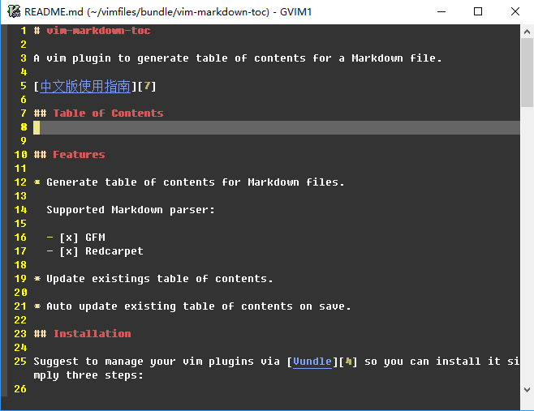
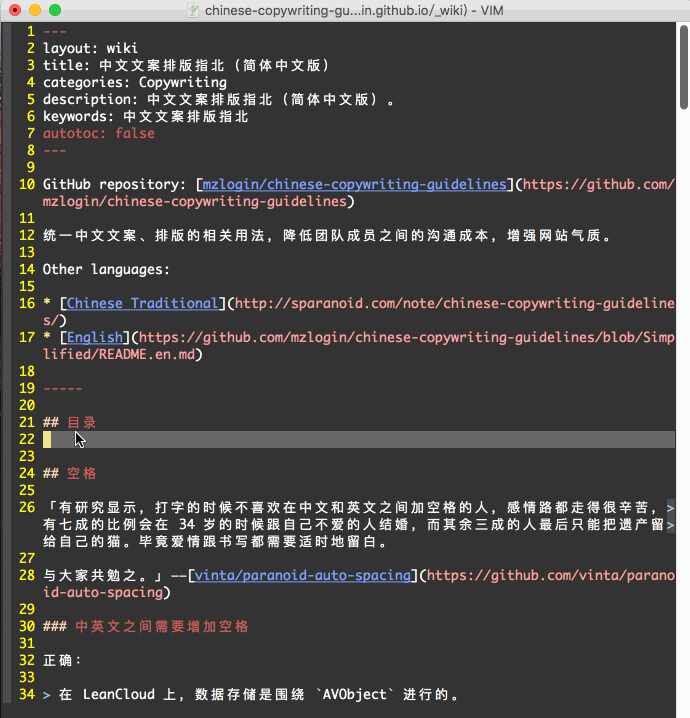

# vim-markdown-toc

A vim plugin to generate table of contents for a markdown file.

[中文版使用指南][7]

## Table of Contents

* [Usage](#usage)
* [Installation](#installation)
* [Screenshots](#screenshots)
* [References](#references)

## Usage

There are *GFM* and *Redcarpet* two styles TOC links, see [here][1] to view their difference.

Move the cursor to the place you want to insert TOC, then type a command below suit you. The command will generate **headings after the cursor** into TOC.

1. `:GenTocGFM`

    Generate table of contents in [GFM][2] link style.

    Suit markdown files in **GitHub repository**, like `README.md`, or **Jekyll/gh-pages use kramdown with GFM support on**.

2. `:GenTocRedcarpet`

    Generate table of contents in [Redcarpet][3] link style.

    Suit **Jekyll/gh-pages or anywhere else use Redcarpet as it's markdown parser**.

## Installation

Suggest to manage your vim plugins via [Vundle][4] so you can install it simply three steps:

1. add the following line to your vimrc file

    ```
    Plugin 'mzlogin/vim-markdown-toc'
    ```

2. `:so $MYVIMRC`

3. `:PluginInstall`

## Screenshots

* [online demo in English][5]



* [online demo in Chinese][6]



## References

* <https://github.com/ajorgensen/vim-markdown-toc>

[1]: http://mazhuang.org/2015/12/05/diff-between-gfm-and-redcarpet/
[2]: https://help.github.com/articles/github-flavored-markdown/
[3]: https://github.com/vmg/redcarpet
[4]: http://github.com/VundleVim/Vundle.Vim
[5]: https://github.com/mzlogin/chinese-copywriting-guidelines/blob/Simplified/README.en.md
[6]: http://mazhuang.org/wiki/chinese-copywriting-guidelines/
[7]: http://mazhuang.org/2015/12/19/vim-markdown-toc/
